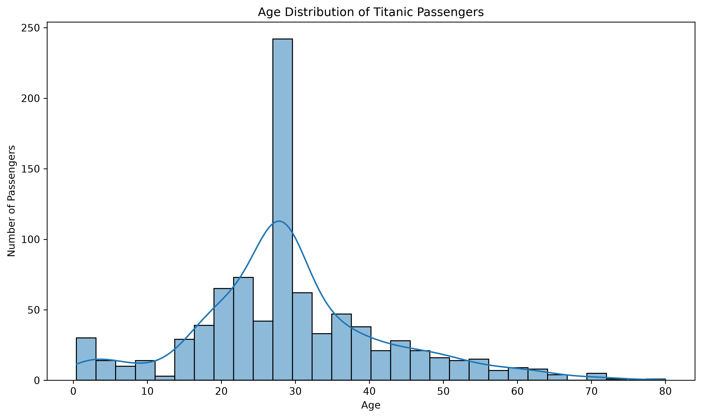

# 🚢 Titanic Survival Prediction – Data Cleaning Project

<p align="center">
  
</p>

<p align="center">
  
  
</p>

---

## 📌 Project Overview

This project is part of my **Week 1 – Machine Learning Fundamentals & Data Preprocessing** learning journey.

The main objective of this project is to understand how a raw dataset can be transformed into a clean and machine-learning-ready dataset.

For this project, I used the **Titanic dataset**, which contains information about passengers who travelled on the RMS Titanic.

The project focuses mainly on:

* 📥 Loading a dataset using Pandas
* 🔎 Understanding and exploring the dataset
* 🧹 Identifying and handling missing values
* 🔢 Encoding categorical variables
* 📊 Visualizing data
* ✂️ Splitting data into training and testing sets
* 💾 Exporting the cleaned dataset
* 🤖 Preparing the data for future Machine Learning models

---

# 🎯 Problem Statement

The Titanic dataset contains passenger information such as:

* Passenger class
* Gender
* Age
* Number of siblings/spouses
* Number of parents/children
* Ticket fare
* Port of embarkation
* Survival status

However, real-world datasets are often **not ready to be directly used by Machine Learning algorithms**.

They may contain:

* Missing values
* Categorical/text data
* Unnecessary columns
* Different data formats
* Inconsistent or incomplete information

Therefore, the main problem addressed in this project is:

> **How can we clean and transform the raw Titanic dataset into a structured and machine-learning-ready dataset?**

---

# 💡 Project Objective

The objectives of this project are:

1. Load the Titanic dataset using Pandas.
2. Explore the structure and statistics of the dataset.
3. Identify missing values.
4. Handle missing values using appropriate techniques.
5. Remove unnecessary columns.
6. Convert categorical variables into numerical form.
7. Visualize passenger age distribution.
8. Analyze survival based on gender.
9. Prepare feature variables and target variables.
10. Split the dataset into training and testing sets.
11. Export the final cleaned dataset as a CSV file.

---

# 📂 Dataset

The project uses:

**Dataset:** `Titanic-Dataset.csv`

The dataset contains passenger-level information from the Titanic.

### Important Columns

| Column        | Description                            |
| ------------- | -------------------------------------- |
| `PassengerId` | Unique passenger identification number |
| `Survived`    | Survival status: 0 = No, 1 = Yes       |
| `Pclass`      | Passenger class                        |
| `Name`        | Passenger name                         |
| `Sex`         | Passenger gender                       |
| `Age`         | Passenger age                          |
| `SibSp`       | Number of siblings/spouses aboard      |
| `Parch`       | Number of parents/children aboard      |
| `Ticket`      | Ticket number                          |
| `Fare`        | Ticket fare                            |
| `Cabin`       | Cabin information                      |
| `Embarked`    | Port of embarkation                    |

---

# 🛠️ Technologies & Libraries Used

The project was developed using Python and the following libraries:

* 🐍 Python
* 🐼 Pandas
* 🔢 NumPy
* 📊 Matplotlib
* 📈 Seaborn
* 🤖 Scikit-learn
* 📓 Jupyter Notebook
* 💻 Visual Studio Code
* 🌐 Git & GitHub

---

# 🔄 Project Workflow

The complete preprocessing workflow is:

```text
Raw Titanic Dataset
        ↓
Load Dataset
        ↓
Explore Dataset
        ↓
Check Missing Values
        ↓
Handle Missing Values
        ↓
Remove Unnecessary Columns
        ↓
Encode Categorical Variables
        ↓
Data Visualization
        ↓
Select Features & Target
        ↓
Train/Test Split
        ↓
Final Data Verification
        ↓
Export Cleaned Dataset
        ↓
Machine Learning Ready Dataset
```

---

# 1️⃣ Import Required Libraries

The first step is importing the required Python libraries.

```python
import pandas as pd
import numpy as np

import matplotlib.pyplot as plt
import seaborn as sns

from sklearn.model_selection import train_test_split
from sklearn.preprocessing import LabelEncoder, OneHotEncoder
```

These libraries are used for:

* Data manipulation
* Numerical operations
* Data visualization
* Categorical encoding
* Train/test splitting

---

# 2️⃣ Load the Dataset

The Titanic dataset is loaded using Pandas.

```python
df = pd.read_csv("../data/Titanic-Dataset.csv")
```

After loading the dataset, the first few records were inspected:

```python
df.head()
```

This helped understand what type of information the dataset contains.

---

# 3️⃣ Dataset Exploration

Before cleaning the data, it is important to understand its structure.

### Dataset Information

```python
df.info()
```

This provides information about:

* Number of rows
* Number of columns
* Column names
* Data types
* Non-null values

### Statistical Summary

```python
df.describe()
```

This provides statistical information such as:

* Mean
* Standard deviation
* Minimum
* Maximum
* Quartiles

For categorical columns, the following was also used:

```python
df.describe(include="all")
```

---

# 4️⃣ Identifying Missing Values

Missing values were checked using:

```python
df.isnull().sum()
```

This helps identify which columns contain incomplete data.

The missing-value percentage was also calculated:

```python
missing_percentage = (df.isnull().sum() / len(df)) * 100

print(missing_percentage)
```

---

# 5️⃣ 🧹 Handling Missing Values

Missing values are one of the most common problems in real-world datasets.

Instead of simply deleting all rows containing missing information, appropriate techniques were used.

## Age – Median Imputation

The `Age` column contains missing values.

Because age can contain extreme values and may not follow a perfectly normal distribution, the **median** was used.

```python
df["Age"] = df["Age"].fillna(df["Age"].median())
```

### Why Median?

The median is less affected by extreme values than the mean.

For example:

```text
Ages:
20, 21, 22, 23, 100
```

The mean is strongly affected by `100`, while the median remains more representative.

---

# 6️⃣ Embarked – Mode Imputation

The `Embarked` column contains a small number of missing values.

The most frequent category was used:

```python
df["Embarked"] = df["Embarked"].fillna(
    df["Embarked"].mode()[0]
)
```

The mode represents the most commonly occurring category.

---

# 7️⃣ Removing the Cabin Column

The `Cabin` column contains a large amount of missing information.

For this beginner-level preprocessing project, the column was removed:

```python
df.drop("Cabin", axis=1, inplace=True)
```

This prevents a large amount of incomplete information from affecting the cleaned dataset.

---

# 8️⃣ 🔢 Encoding Categorical Variables

Machine Learning algorithms generally require numerical input.

However, Titanic contains categorical variables such as:

```text
Sex
Embarked
```

Therefore, these variables need to be converted into numerical form.

---

# 9️⃣ Label Encoding – Sex

The `Sex` column was converted into numerical values using `LabelEncoder`.

```python
label_encoder = LabelEncoder()

df["Sex"] = label_encoder.fit_transform(df["Sex"])
```

The values become approximately:

```text
female → 0
male   → 1
```

This allows the column to be processed by Machine Learning algorithms.

---

# 🔟 One-Hot Encoding – Embarked

The `Embarked` column contains three categories:

```text
C
Q
S
```

One-Hot Encoding was used to convert these categories into separate binary columns.

```python
one_hot_encoder = OneHotEncoder(
    sparse_output=False,
    handle_unknown="ignore"
)

embarked_encoded = one_hot_encoder.fit_transform(
    df[["Embarked"]]
)
```

The encoded column names were obtained using:

```python
encoded_column_names = one_hot_encoder.get_feature_names_out(
    ["Embarked"]
)

print(encoded_column_names)
```

The result is:

```text
Embarked_C
Embarked_Q
Embarked_S
```

---

# 1️⃣1️⃣ Creating Encoded DataFrame

The encoded values were converted into a DataFrame:

```python
embarked_df = pd.DataFrame(
    embarked_encoded,
    columns=encoded_column_names,
    index=df.index
)
```

The new columns were then added to the original dataset:

```python
df = pd.concat([df, embarked_df], axis=1)
```

Finally, the original `Embarked` column was removed:

```python
df.drop("Embarked", axis=1, inplace=True)
```

---

# 1️⃣2️⃣ 📊 Data Visualization

Visualization helps us understand patterns in the dataset.

## Age Distribution

A histogram was created to visualize passenger ages.

```python
plt.figure(figsize=(10, 6))

sns.histplot(
    data=cleaned_df,
    x="Age",
    bins=30,
    kde=True
)

plt.title("Age Distribution of Titanic Passengers")
plt.xlabel("Age")
plt.ylabel("Number of Passengers")

plt.tight_layout()

plt.savefig(
    "../images/age_distribution.png",
    dpi=300,
    bbox_inches="tight"
)

plt.show()
```

### Observation

The visualization helps identify:

* The general age distribution
* Concentration of passengers in different age groups
* Approximate shape of the age distribution

---

# 1️⃣3️⃣ 👥 Survival by Gender

A second visualization was created to compare survival between genders.

```python
plt.figure(figsize=(8, 5))

sns.countplot(
    data=df,
    x="Sex",
    hue="Survived"
)

plt.title("Titanic Survival by Gender")
plt.xlabel("Sex (0 = Female, 1 = Male)")
plt.ylabel("Number of Passengers")

plt.tight_layout()

plt.savefig(
    "../images/survival_by_gender.png",
    dpi=300,
    bbox_inches="tight"
)

plt.show()
```

This visualization provides a simple comparison of survival outcomes between male and female passengers.

---

# 1️⃣4️⃣ 🎯 Feature Selection

After preprocessing, the relevant columns were selected as Machine Learning features.

```python
features = [
    "Pclass",
    "Sex",
    "Age",
    "SibSp",
    "Parch",
    "Fare",
    "Embarked_C",
    "Embarked_Q",
    "Embarked_S"
]

target = "Survived"
```

The features and target were then separated:

```python
X = df[features]
y = df[target]
```

Where:

* `X` = Input features
* `y` = Target variable

---

# 1️⃣5️⃣ ✂️ Train/Test Split

The dataset was divided into training and testing data.

```python
X_train, X_test, y_train, y_test = train_test_split(
    X,
    y,
    test_size=0.2,
    random_state=42,
    stratify=y
)
```

### Dataset Split

Approximately:

```text
80% → Training Data
20% → Testing Data
```

The `random_state=42` ensures that the split is reproducible.

`stratify=y` helps maintain a similar survival-class distribution in both training and testing sets.

---

# 1️⃣6️⃣ 💾 Export Cleaned Dataset

After preprocessing, the cleaned dataset was created:

```python
cleaned_df = pd.concat([X, y], axis=1)
```

It was then exported as:

```python
cleaned_df.to_csv(
    "../data/Titanic-Cleaned.csv",
    index=False
)
```

The final output is:

```text
Titanic-Cleaned.csv
```

This file contains the processed data that can be used for future Machine Learning models.

---

# 1️⃣7️⃣ ✅ Final Data Verification

The final dataset was checked for missing values:

```python
print(cleaned_df.isnull().sum())
```

Duplicate records were also checked:

```python
print("Duplicate Rows:",
      cleaned_df.duplicated().sum())
```

Dataset information was verified using:

```python
cleaned_df.info()
```

These checks ensure that the preprocessing process was successful.

---

# 📁 Project Structure

```text
Titanic-Survival-Prediction/
│
├── data/
│   ├── Titanic-Dataset.csv
│   └── Titanic-Cleaned.csv
│
├── images/
│   ├── titanic_banner.png
│   ├── age_distribution.png
│   └── survival_by_gender.png
│
├── notebooks/
│   └── Titanic_Data_Cleaning.ipynb
│
├── src/
│   └── data_cleaning.py
│
├── README.md
│
├── requirements.txt
│
└── .gitignore
```

---

# 📊 Before vs After Data Processing

| Stage         | Dataset Condition                   |
| ------------- | ----------------------------------- |
| Raw Dataset   | Contains missing values             |
| Age           | Missing values replaced with median |
| Embarked      | Missing values replaced with mode   |
| Cabin         | Removed                             |
| Sex           | Label encoded                       |
| Embarked      | One-hot encoded                     |
| Features      | Selected for ML                     |
| Dataset Split | 80% train / 20% test                |
| Final Dataset | Machine-learning ready              |

---

# 🧠 What I Learned

Through this project, I learned the fundamentals of data preprocessing.

### Key Learnings

* How to load datasets using Pandas
* How to inspect datasets using `.info()` and `.describe()`
* How to identify missing values
* Difference between mean, median, and mode imputation
* How to handle missing data
* How categorical variables can be converted into numerical values
* How Label Encoding works
* How One-Hot Encoding works
* How to visualize data using Matplotlib and Seaborn
* How to separate features and target
* How to perform train/test splitting
* How to export processed data
* How to organize a Machine Learning project for GitHub

---

# ⚠️ Important Preprocessing Consideration

In a real Machine Learning project, preprocessing steps such as imputation and encoding should ideally be fitted **only on the training data** and then applied to the test data.

This prevents **data leakage**.

For this Week 1 project, the main focus was understanding the preprocessing techniques and building the complete workflow.

In future projects, I will implement these steps using Scikit-learn pipelines.

---

# 🚀 Future Improvements

The next stage of this project can include:

* 🤖 Logistic Regression
* 🌳 Decision Tree
* 🌲 Random Forest
* 📈 Model evaluation
* 🎯 Accuracy, Precision, Recall and F1-score
* 📊 Confusion Matrix
* 🔍 Feature importance
* ⚙️ Hyperparameter tuning
* 🔄 Scikit-learn preprocessing pipelines
* 📦 Model deployment

The ultimate goal is to develop a complete **Titanic Survival Prediction Machine Learning model**.

---

# 🏆 Project Status

```text
✅ Dataset Loading
✅ Data Exploration
✅ Missing Value Handling
✅ Categorical Encoding
✅ Data Visualization
✅ Feature Selection
✅ Train/Test Split
✅ Cleaned Dataset Export
⬜ Machine Learning Model
⬜ Model Evaluation
⬜ Hyperparameter Tuning
⬜ Deployment
```

**Current Status: Data Preprocessing Completed ✅**

---

# 👨‍💻 Author

**Arghya Paul**

B.Tech – Electronics Engineering

This project is part of my **Machine Learning & AI learning journey**.

---

# ⭐ Acknowledgement

This project was created for educational purposes as part of a Machine Learning and Data Preprocessing learning project.

---

# 📜 License

This project is intended for educational and learning purposes.
